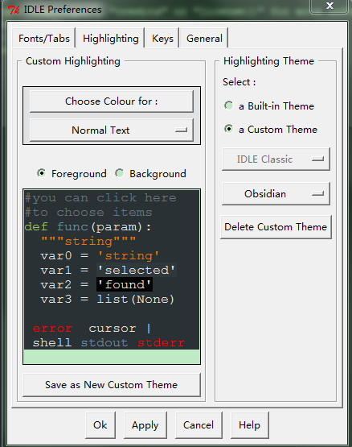
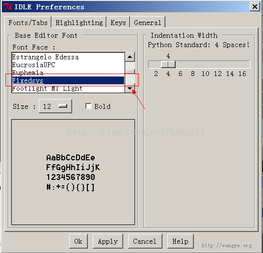

## Python背景色与语法高亮主题配置

使用python idle的人恐怕都无法忍受默认的白色背景，及其语法高亮主题。

大家更倾向于使用黑色背景，更有程序员Style。

在window下，可以直接在运行框中输入下面的路径定位到位置：%USERPROFILE%/.idlerc/

有时候会发现目录中没有config-highlight.cfg文件，那么自己就创建一个：notepad %USERPROFILE%/.idlerc/config-highlight.cfg

* 下面介绍Obsidian, Desert, 和Tango三种主题配置

在用户目录的.idlerc目录下新建名为config-highlight.cfg文件，并加入如下内容：

<pre name="code" class="cfg">

[tango]
definition-foreground = #fce94f
error-foreground = #fa8072
string-background = #2e3436
keyword-foreground = #8cc4ff
normal-foreground = #ffffff
comment-background = #2e3436
hit-foreground = #ffffff
break-foreground = #000000
builtin-background = #2e3436
stdout-foreground = #eeeeec
cursor-foreground = #fce94f
hit-background = #2e3436
comment-foreground = #73d216
hilite-background = #edd400
definition-background = #2e3436
stderr-background = #2e3436
break-background = #2e3436
console-foreground = #87ceeb
normal-background = #2e3436
builtin-foreground = #ad7fa8
stdout-background = #2e3436
console-background = #2e3436
stderr-foreground = #ff3e40
keyword-background = #2e3436
string-foreground = #e9b96e
hilite-foreground = #2e3436
error-background = #2e3436
 
[desert]
definition-foreground = #98fb98
error-foreground = #ff0000
string-background = #333333
keyword-foreground = #cc6600
normal-foreground = #f0e68c
comment-background = #333333
hit-foreground = #ffffff
break-foreground = black
builtin-background = #333333
stdout-foreground = #eeeeee
cursor-foreground = #ffcc00
hit-background = #333333
comment-foreground = #87ceeb
hilite-background = gray
definition-background = #333333
stderr-background = #333333
break-background = #ffff55
console-foreground = #87ceeb
normal-background = #333333
builtin-foreground = #519e51
stdout-background = #333333
console-background = #333333
stderr-foreground = #ff3e40
keyword-background = #333333
string-foreground = #ffa0a0
hilite-foreground = #000000
error-background = #000000
 
[Obsidian]
definition-foreground = #678CB1
error-foreground = #FF0000
string-background = #293134
keyword-foreground = #93C763
normal-foreground = #E0E2E4
comment-background = #293134
hit-foreground = #E0E2E4
builtin-background = #293134
stdout-foreground = #678CB1
cursor-foreground = #E0E2E4
break-background = #293134
comment-foreground = #66747B
hilite-background = #2F393C
hilite-foreground = #E0E2E4
definition-background = #293134
stderr-background = #293134
hit-background = #000000
console-foreground = #E0E2E4
normal-background = #293134
builtin-foreground = #E0E2E4
stdout-background = #293134
console-background = #293134
stderr-foreground = #FB0000
keyword-background = #293134
string-foreground = #EC7600
break-foreground = #E0E2E4
error-background = #293134

</pre>

* 重启IDLE，依次选 Options -> Configure IDLE -> Highlighting 如下图：

* 有童鞋要问字体怎么配置？这个容易，在Highlighting选项卡旁边有个Fonts/Tabs选项卡，可以用来配置字体和缩进宽度的：

> [CSDN：Python背景色与语法高亮主题配置](https://blog.csdn.net/bitezijie/article/details/70135700)
