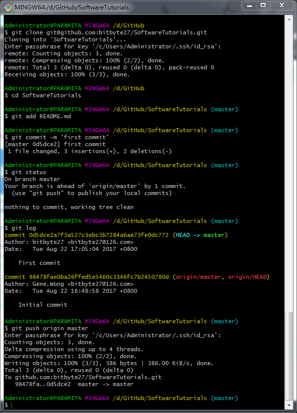

## Git For Windows
安装配置教程：https://jingyan.baidu.com/article/a65957f4e91ccf24e77f9b11.html  
 
  

## Git Push Repository to Github
  

## 从0开始学习GitHub
http://ooou6mjma.bkt.clouddn.com/StudyGitHub.pdf
