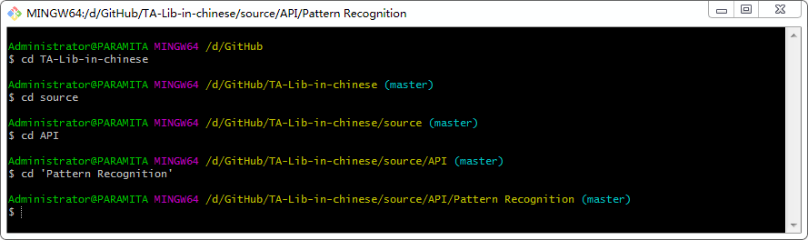

## Git Bash
1. cd 文件目录
2. git add 文件名.扩展名
3. git commit -m '更改的提示'
4. git push origin master
5. 输入GitHub密码
* 对于更改一个文件，这个方式是不错的，但多个文件，每个都要add→commit，那就耗死了，还在摸索更好的方法。
* 文件名、文件目录尽量不要有空格，有空格的文件目录用单引号括起来，如：cd ‘Pattern Recognition’。  

