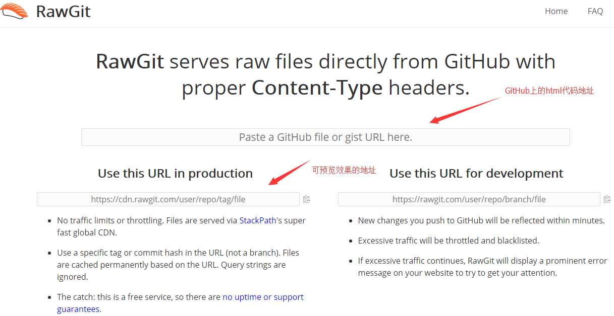
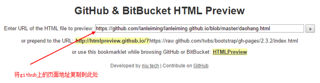
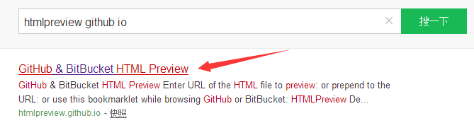
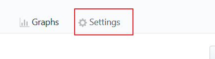
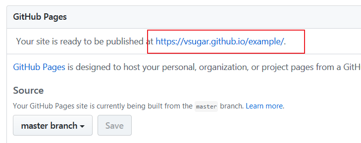

## 在GitHub上预览html网页效果的方法

### 方法一

> http://rawgit.com/

> 把需要预览的GitHub代码地址粘贴到这里，下面就会自动生成预览链接，使用自动生成的链接即可预览。

### 方法二（适应于简单的html网页，复杂页面会影响预览效果）

> 通过http://htmlpreview.github.io/ 这个网站把地址输进去

> 如果网页打不开可以直接去搜这个试试

### 方法三

* 第一种是在你打开的源码地址的url地址基础上加http://htmlpreview.github.io/?
* 或者http://htmlpreview.github.com/? (注：填这个还是会转到前面那个前缀去的)前缀。
* 第二种就是在你的项目branch上添加一个gh-pages分支，然后将你的项目复制一份到这个分支上，然后再进入settings的github pages进行设置就OK了。
* 总结下上面两种，添加前缀的方式确实比较简单，但是东西多了就会加载很慢，甚至不能正确的显示css样式，对于显示js的效果就更不使用了。所以，赶快放弃吧！创建分支的方式确实是很麻烦额，之前就是感觉麻烦的不得了所以没用这种方式，接下来要介绍的是创建分支的升级版。

> 第一步：找到你要展示的repo中的Settings

> 第二步：找到github pages那一栏,在Source中选择master branch,然后save。

> 第三步：睁大你的眼睛找到你自己的这串地址

> 然后就可以愉快的预览了

