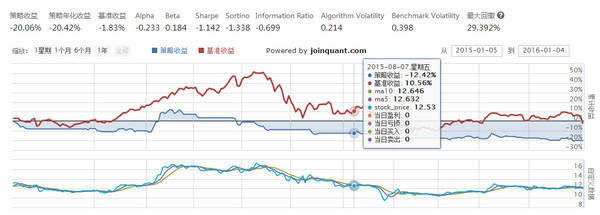

> 发现了【聚宽】https://www.joinquant.com/，这个平台，开始做一些策略回测，学习代码语言已经策略表达。

<pre name="code" class="halcon">
def initialize(context):
    # 定义一个全局变量, 保存要操作的股票
    # 000001(股票:平安银行)
    g.security = '000776.XSHE'
    # 初始化此策略
    # 设置我们要操作的股票池, 这里我们只操作一支股票
    set_universe([g.security])
</pre>

<pre name="code" class="halcon">
# 每个单位时间(如果按天回测,则每天调用一次,如果按分钟,则每分钟调用一次)调用一次
def handle_data(context, data):
    security = g.security
    # 得到200日均线价格
    maD = data[security].mavg(250, 'close')
    # 得到昨天价格
    price = data[security].close
    # 得到当前资金余额
    cash = context.portfolio.cash
    # 如果当前有余额，并且上一时间点价格低于200日均线平均价格，买入
    if price > maD:
        order_value(security, cash)
        # 记录这次买入
        log.info("Buying %s" % (security))
    # 如果当前价格高于200日平均价格，并且目前有头寸，卖出
    elif price < maD and context.portfolio.positions[security].amount > 0:
        # 全部卖出
        order_target(security, 0)
        # 记录这次卖出
        log.info("Selling %s" % (security))
    # 绘制股票价格
    record(stock_price=price)
</pre>
    
* 端午节刚过，生日也过，正式步入奔四的节奏，有一些新的尝试也要开始了，量化投资会是我未来的发展方向，最近开启了JoinQuant的旅程。

> JoinQuant：https://www.joinquant.com/
> 很优秀的平台，开始做量化策略。

* 第一个测试的策略，自带的《双均线策略》，简言之就是：当五日均线高于十日均线时第二个交易日开盘价买入，当五日均线低于十日均线时第二个交易日开盘价卖出。只要有现金就全仓买入，通过回测，收益率很差的，这当然是正常，也就说明我们很多所谓的老股民的股经，是多么的荒诞。

* 详细代码：https://www.joinquant.com/api#双均线策略
* 通过这样的练习和测试，可以排除很多荒诞的策略，去其糟粕，萃得精华。
