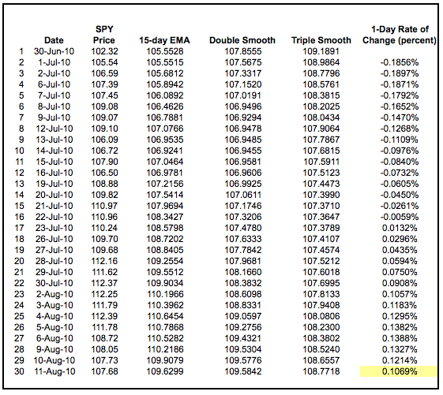
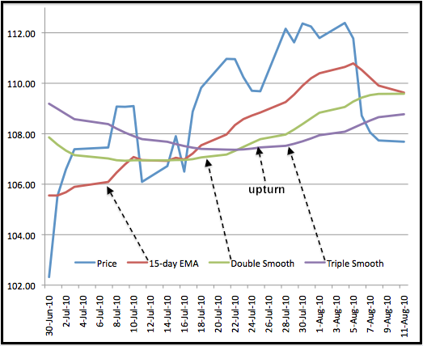
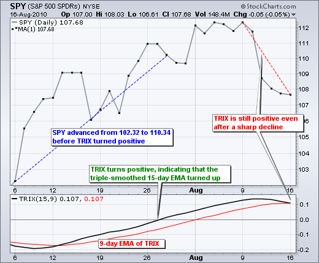
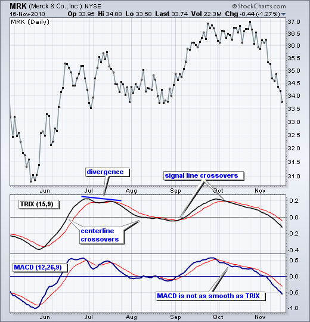
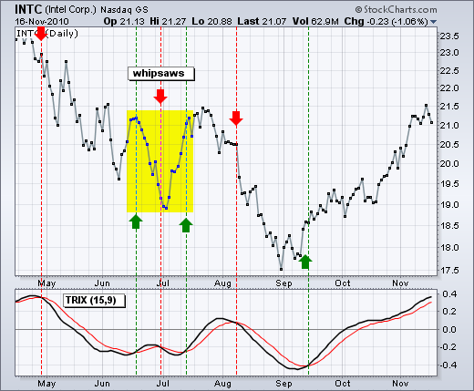
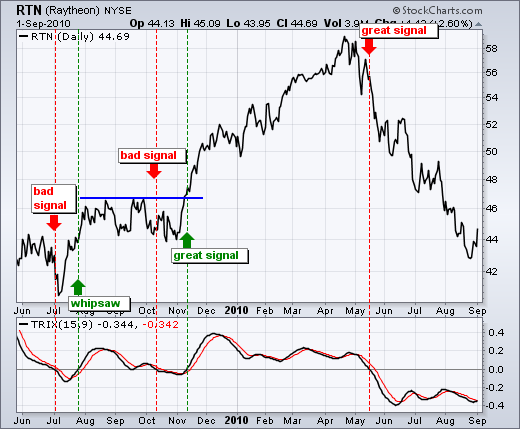
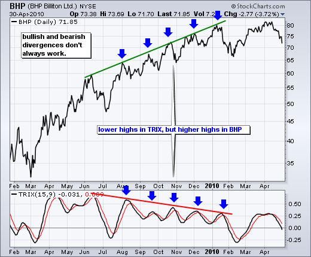
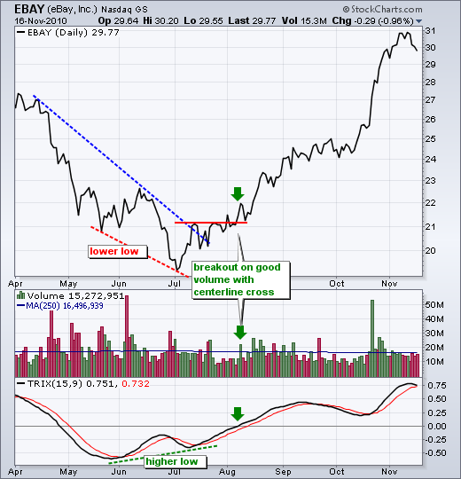
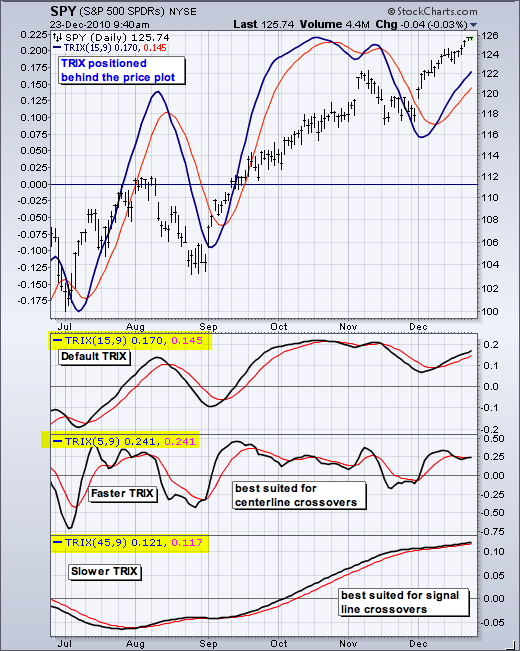

# 03.TRIX
* [TRIX](http://stockcharts.com/school/doku.php?id=chart_school:technical_indicators:trix)

## Introduction
* TRIX is a momentum oscillator that displays the percent rate of change of a triple exponentially smoothed moving average. It was developed in the early 1980's by Jack Hutson, an editor for Technical Analysis of Stocks and Commodities magazine. With its triple smoothing, TRIX is designed to filter insignificant price movements. Chartists can use TRIX to generate signals similar to MACD. A signal line can be applied to look for signal line crossovers. A directional bias can be determined with the absolute level. Bullish and bearish divergences can be used to anticipate reversals.

* Trix是一个动量振荡器，它显示三重指数平滑移动平均的百分比变化率。它是由“股票与商品技术分析”杂志的编辑杰克·哈特森在1980年代初开发的。TRIX的三重平滑功能旨在过滤微不足道的价格波动。CHARMER可以使用TRIX来产生类似MACD的信号。信号线可应用于寻找信号线交叉器。方向偏置可以用绝对电平来确定。看涨和看跌分歧可以用来预测反转。

## Calculation
* TRIX is the 1-period percentage rate-of-change for a triple smoothed exponential moving average (EMA), which is an EMA of an EMA of an EMA. Here is a breakdown of the steps involved for a 15 period TRIX.

* Trix是三次平滑指数移动平均(EMA)的一个周期变化率，它是EMA的EMA。以下是15期TRIX所涉步骤的细目。

1. Single-Smoothed EMA = 15-period EMA of the closing price
2. Double-Smoothed EMA = 15-period EMA of Single-Smoothed EMA
3. Triple-Smoothed EMA = 15-period EMA of Double-Smoothed EMA
4. TRIX = 1-period percent change in Triple-Smoothed EMA

* The table and chart below provide examples for the 15-day EMA, double-smoothed EMA and triple-smoothed EMA. Notice how each EMA lags price a little more. Even though exponential moving averages put more weight on recent data, they still contain past data that produces a lag. This lag increases with each smoothing.

* 下表和图表提供了15天均线、双平滑均线和三平顺均线的例子。注意每个EMA是如何延迟价格的。尽管指数移动平均法对最近的数据给予了更多的权重，但它们仍然包含了产生滞后的过去数据。这种滞后随平滑度的增加而增加。

* The blue line is the price plot for SPY. It is clearly the most jagged (volatile) of the four lines. The red line is the 15-day EMA, which follows the price plot the closest. The green line is the double-smoothed EMA and the purple line is the triple-smoothed EMA. Notice how these two lines turn flatter as the lag increases.

* 蓝线是SYP的价格。这显然是这四条线中最锯齿状的(不稳定)。红线是15天均线，这是最接近的价格图。绿线是双平滑的EMA，紫色的是三次平滑的EMA.注意这两行是如何随着滞后的增加而变得更加平缓。

* TRIX is negative as long as the triple-smoothed 15-day EMA is moving lower. TRIX turns positive when the triple-smoothed 15-day EMA turns up. The extra smoothing ensures that upturns and downturns are kept to a minimum. In other words, it takes more than a one-day advance to reverse a downtrend.

* 只要三线平滑的15天均线走低，Trix就为负数.当三倍平滑的15天均线出现时，Trix变成正数。额外的平滑确保上下波动保持在最小。换句话说，要扭转下跌趋势，需要一天以上的时间。

## Interpretation
* TRIX (15,9) is quite similar to MACD (12,26,9). Both are momentum oscillators that fluctuate above and below the zero line. Both have signal lines based on a 9-day EMA. Most notably, both lines have similar shapes, signal line crossovers, and centerline crosses. The biggest difference between TRIX and MACD is that TRIX is smoother than MACD. The TRIX lines are less jagged and tend to turn a bit later.

* TRIX (15,9) 和 MACD (12,26,9)很相似，两者都是在零线上下波动的动量振子。两家公司都有基于9天均线的信号线。最值得注意的是，这两条线都有相似的形状，信号线交叉和中心线交叉。TRIX与MACD最大的区别在于TRIX比MACD更平滑。TRIX线不那么锯齿状，而且倾向于稍晚一点转向。

* With the similarities outweighing the differences, signals applicable to MACD are also applicable to TRIX. There are three main signals to watch for. First, signal line crossovers are the most common signals. These indicate a change in direction for TRIX and price momentum. A cross above the signal line is the first bullish indication, while a cross below is the first negative implication. Second, centerline crossovers provide chartists with a general momentum bias. The triple-smoothed moving average is rising when TRIX is positive and falling when negative. Similarly, momentum favors the bulls when TRIX is positive and the bears when negative. Third, bullish and bearish divergences can alert chartists of a possible trend reversal.

* 由于相似性大于差异，适用于MACD的信号也适用于TRIX。有三个主要信号需要注意。首先，信号线交叉是最常见的信号。这表明TRIX的方向和价格势头发生了变化。信号线上方的交叉是第一个看涨的迹象，而下方的交叉是第一个负面的暗示。第二，中心线交叉提供了一个普遍的动量偏差的特点。三平滑移动平均线在TRIX为正时上升，负时下降.同样，当TRIX为正值时，动量有利于多头，而空头则为负数。第三，多头和看跌的分歧可以提醒魅力投资者可能出现趋势逆转。

## Signal Line Crossovers
* Signal line crossovers are the most common TRIX signals. The signal line is a 9-day EMA of the TRIX. As a moving average of the indicator, it trails TRIX and makes it easier to spot turns. A bullish crossover occurs when TRIX turns up and crosses above the signal line. A bearish crossover occurs when TRIX turns down and crosses below the signal line. Crossovers can last a few days or a few weeks, it all depends on the strength of the move. Due diligence is required before relying on these frequent signals. Volatility in the underlying security can also increase the number of crossovers.

* 信号线交叉是最常见的TRIX信号。信号线是TRIX的9天均线.作为该指示器的移动平均值，它跟踪TRIX，使它更容易发现转弯。当TRIX出现并越过信号线时，就会出现一个牛市交叉。当TRIX掉头并穿过信号线下方时，就会出现看跌交叉。交叉可以持续几天或几周，这一切都取决于力度的移动。在依赖这些频繁的信号之前，需要尽职调查。潜在证券的波动性也会增加交叉证券的数量。

* The chart above shows Intel (INTC) and TRIX with six signal line crosses in a seven-month period. That is almost one per month. There were three good signals and three bad signals resulting in whipsaws (yellow area). The bullish crossover in June occurred near the top, the bearish crossover in late June occurred near the low and the bullish crossover in July occurred near the top. In the absence of a strong move, the lag from the triple-smoothed EMA results in late signals that produce losses. The bearish signal line cross in August foreshadowed a sharp decline and the bullish signal line cross in mid-September foreshadowed a strong advance.

* 上面的图表显示了英特尔（ITCC）和TIX在七个月内有六条信号线交叉。差不多一个月一个。有三个良好的信号和三个坏信号导致鞭锯（黄色区域）。六月的看涨交易发生在顶部附近，六月下旬的熊市交叉点发生在低点附近，七月的牛市交叉点发生在顶部附近。在没有强移动的情况下，从三次平滑EMA的滞后导致产生损耗的晚期信号。8月份看跌信号线交叉预示着大幅下跌，九月中旬看涨信号线预示着强劲的上涨。

## Centerline Crossovers
* The centerline crossover indicates when the cup is half full (bullish) or half empty (bearish). Think of the centerline as the 50-yard line in a football game. The offense has the edge after crossing the 50 (midpoint), while the defense has the edge as long as the ball remains beyond the 50. As with signal line crossovers, these centerline crossovers produce both good signals and bad signals. The key, as always, is to minimize losses on the bad signals and maximize gains with the good signals.

* 中线交叉标志着当杯子是半满(牛市)或半空(看跌)。把中线想象成足球比赛中的50码线。进攻在过关50(中点)后有优势，而防守有优势，只要球保持在50以上。与信号线交叉器一样，这些中心线交叉器产生好信号和坏信号。关键，一如既往，是尽量减少坏信号的损失，最大限度地利用好信号的收益。

* The chart above shows Raytheon (RTN) with five signals over a 16 month period. The first three were bad because the stock changed direction soon after the signals. In other words, a trend failed to take hold. The fourth signal (November 2009) coincided with a resistance breakout and foreshadowed a 20% advance. Great signal! This is also a classic example of combining indicator signals with chart signals for reinforcement. The resistance breakout on the price chart and the centerline cross for the TRIX reinforced each other. TRIX produced a nice bearish signal in May 2010 as RTN subsequently declined around 20%.

* 上图显示雷神公司(RTN)在16个月内发出了5个信号。前三种情况都很糟糕，因为股票在信号发出后不久就改变了方向。换句话说，一种趋势未能站稳脚跟。第四个信号(2009年11月)恰逢抵抗的爆发，预示着20%的进步。好信号！这也是一个典型的例子，结合指示信号和图表信号，以加强。价格图上的阻力突破和TRIX的中心线交叉相互加强。TRIX在2010年5月发出了一个不错的看跌信号，RTN随后下跌了20%左右。

## Divergences
* Bullish and bearish divergences form when the security and the indicator do not confirm one another. A bullish divergence forms when the security forges a lower low, but the indicator forms a higher low. This higher low shows less downside momentum that may foreshadow a bullish reversal. A bearish divergence forms when the security forges a higher low, but the indicator forms a lower high. This lower high shows waning upside momentum that can sometimes foreshadow a bearish reversal. Before looking at a successful divergence, note the BHP Billiton (BHP) chart with several unsuccessful divergences.

* 当安全和指标之间不确定时，多头和看跌的分歧就形成了。当证券市场形成较低的低点时，就会形成看涨的差异，而指数则会形成较高的低点。这一较高的低点显示，可能预示牛市逆转的下行势头减弱。当证券价格处于较高低点时，就会形成看跌的差异，而指标则会形成较低的高点。这一较低的高点显示上升势头减弱，有时可能预示着看跌逆转。在观察一个成功的分歧之前，请注意必和必拓(BHPBilliton)的图表，其中有几个不成功的分歧。

* Bearish divergences do not work well in strong uptrends. Even though momentum seems to be waning because the indicator is producing lower highs, momentum still has a bullish bias as long as the indicator is above its centerline. Upward momentum may be less positive, but it is still positive as long as the cup is half full. The rise is just not as fast as before. The opposite is true for bullish divergences. These do not work well in strong downtrends. Even though the indicator shows less downside momentum with higher lows, downward momentum is still stronger than upward momentum as long as the indicator remains below its centerline.

* 在强劲的上涨趋势中，看跌分歧并不能很好地发挥作用。尽管动量似乎正在减弱，因为该指标正在产生较低的高点，但只要该指标高于其中心线，动量仍有看涨的倾向。向上的势头可能不那么积极，但只要杯子半满，它仍然是积极的。增长速度不如以前那么快。而对于看涨的分歧，则恰恰相反。在强劲的下行趋势中，这些措施效果不佳。尽管该指标显示较低的下行动能较少，但只要该指标保持在中心线以下，下行势头仍比上行势头更强。

* When bullish and bearish divergences work, they do work great. The trick is separating the bad signals from the good signals. The chart below shows eBay (EBAY) with a successful bullish divergence. The stock moved to a lower low in early July, but TRIX held well above its prior low and formed a bullish divergence. The first potential confirmation came when TRIX moved above its signal line. However, there were no confirmations on the chart at the time. These came a little later. The green arrows show EBAY breaking chart resistance with good volume and TRIX moving into positive territory. Even though confirmation occurred well off the low, there were enough signs of strength to validate the breakout.

* 当看涨和看跌的分歧奏效时，他们的表现确实不错。诀窍是把坏信号和好信号分开。下图显示了易趣网（易趣网）成功的看涨背离。七月初，该股跌至较低的低点，但Trx仍远高于此前的低点，形成了看涨的背离。当TIX移动到信号线之上时，第一个潜在的确认信号出现了。然而，当时在图表上没有确认。一会儿就来了。绿色箭头显示易趣网打破图表阻力，良好的音量和Trex进入积极的领域。即使证实发生在低点，也有足够的力量来证明突破。

## Conclusions
* TRIX is an indicator that combines trend with momentum. The triple smoothed moving average covers the trend, while the 1-period percentage change measures momentum. In this regard, TRIX is similar to MACD and PPO. The standard setting for TRIX is 15 for the triple smoothed EMA and 9 for the signal line. Chartists looking for more sensitivity should try a shorter timeframe (5 versus 15). This will make the indicator more volatile and better suited for centerline crossovers. Chartists looking for less sensitivity should try a longer timeframe (45 versus 15). This will smooth the indicator and make it better suited for signal line crossovers. As with all indicators, TRIX should be used in conjunction with other aspects of technical analysis, such as chart patterns.

* TRIX是一个趋势和势头相结合的指标。三次平滑的移动平均线涵盖了趋势，而1期百分比的变化是衡量动量的.在这方面，TRIX类似于MACD和PPO。TRIX的标准设置对于三次平滑EMA为15，对于信号线为9。希望获得更多敏感性的艺术家应该尝试更短的时间框架(5比15)。这将使指标更易波动，更适合中心线交叉。寻求较低敏感度的艺术家应该尝试更长的时间框架(45对15)。这将使指示器平滑，使其更适合于信号线交叉。与所有指标一样，TRIX应与技术分析的其他方面，例如图表模式结合使用。

## Further Study
《Technical Analysis - Power Tools for Active Investors》（Gerald Appel）
