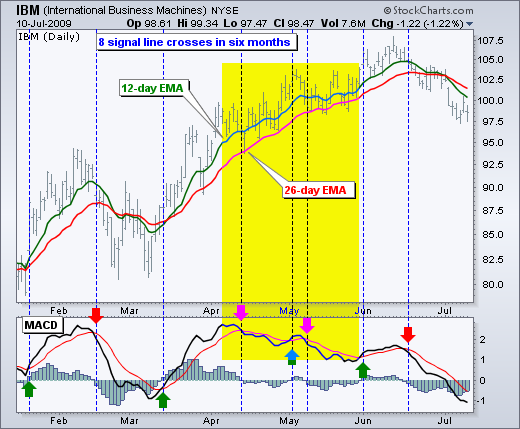

# MACD（Moving Average Convergence/Divergence Oscillator）
* [MACD (Moving Average Convergence/Divergence Oscillator)](http://stockcharts.com/school/doku.php?id=chart_school:technical_indicators:moving_average_convergence_divergence_macd)

* [MACD-Histogram](http://stockcharts.com/school/doku.php?id=chart_school:technical_indicators:macd-histogram)

## Introduction
* Developed by Gerald Appel in the late seventies, the Moving Average Convergence/Divergence oscillator (MACD) is one of the simplest and most effective momentum indicators available. The MACD turns two trend-following indicators, moving averages, into a momentum oscillator by subtracting the longer moving average from the shorter moving average. As a result, the MACD offers the best of both worlds: trend following and momentum. The MACD fluctuates above and below the zero line as the moving averages converge, cross and diverge. Traders can look for signal line crossovers, centerline crossovers and divergences to generate signals. Because the MACD is unbounded, it is not particularly useful for identifying overbought and oversold levels.

* 移动平均辐合发散振荡器(MACD)是由Gerald极大值于70年代后期发展起来的一种最简单、最有效的动量指标。MACD将两个趋势跟踪指标，移动平均线，通过从较短移动平均线中减去较长的移动平均值，变成一个动量振子。因此，MACD提供了最好的两个世界：趋势跟踪和势头。当移动平均线收敛、交叉和发散时，MACD在零线上下波动。交易者可以寻找信号线交叉，中心线交叉和分歧产生信号。因为MACD是无界的，所以它对于识别超买和超卖水平并不特别有用。

* Note: MACD can be pronounced as either “Mac-Dee” or “M-A-C-D.”

#### Here is an example chart with the MACD indicator in the lower panel:

## Calculation
* The MACD Line is the 12-day Exponential Moving Average (EMA) less the 26-day EMA. Closing prices are used for these moving averages. A 9-day EMA of the MACD Line is plotted with the indicator to act as a signal line and identify turns. The MACD Histogram represents the difference between MACD and its 9-day EMA, the Signal line. The histogram is positive when the MACD Line is above its Signal line and negative when the MACD Line is below its Signal line.

* MACD线是12天指数移动平均线(EMA)减去26天均线(EMA).。收盘价用于这些移动平均线。MACD线的9天EMA被绘制成指示符，作为信号线和识别转弯。MACD直方图表示MACD与其9天EMA(信号线)之间的差异.。当MACD线在信号线上方时，直方图为正；当MACD线低于其信号线时，直方图为负值。

> MACD Line: (12-day EMA - 26-day EMA) Signal Line: 9-day EMA of MACD Line MACD Histogram: MACD Line - Signal Line 

* The values of 12, 26 and 9 are the typical setting used with the MACD, however other values can be substituted depending on your trading style and goals.

## Interpretation
* As its name implies, the MACD is all about the convergence and divergence of the two moving averages. Convergence occurs when the moving averages move towards each other. Divergence occurs when the moving averages move away from each other. The shorter moving average (12-day) is faster and responsible for most MACD movements. The longer moving average (26-day) is slower and less reactive to price changes in the underlying security.

* 顾名思义，MACD完全是关于两个移动平均线的收敛和发散。当移动平均线向对方移动时，就会发生收敛。散度是当移动平均线彼此移动时发生的。较短的移动平均时间(12天)更快，并对大多数MACD运动负责.。较长的移动均线(26天)较慢，对基础证券价格变化的反应较小。

* The MACD Line oscillates above and below the zero line, which is also known as the centerline. These crossovers signal that the 12-day EMA has crossed the 26-day EMA. The direction, of course, depends on the direction of the moving average cross. Positive MACD indicates that the 12-day EMA is above the 26-day EMA. Positive values increase as the shorter EMA diverges further from the longer EMA. This means upside momentum is increasing. Negative MACD values indicate that the 12-day EMA is below the 26-day EMA. Negative values increase as the shorter EMA diverges further below the longer EMA. This means downside momentum is increasing.

* MACD线在零线之上和下面振荡，这也被称为中心线。这些交叉信号表明12天的均线已经越过了26天的均线.。当然，方向取决于移动平均交叉的方向。MACD阳性表明，12天的EMA高于26天的EMA.。正值随着EMA时间的缩短而增加，与较长的EMA值进一步偏离。这意味着上行势头正在增强。负MACD值表明12天均线低于26天均线.。随着EMA时间越短，EMA值越低，负值越大。这意味着下行势头正在增强。

* In the example above, the yellow area shows the MACD Line in negative territory as the 12-day EMA trades below the 26-day EMA. The initial cross occurred at the end of September (black arrow) and the MACD moved further into negative territory as the 12-day EMA diverged further from the 26-day EMA. The orange area highlights a period of positive MACD values, which is when the 12-day EMA was above the 26-day EMA. Notice that the MACD Line remained below 1 during this period (red dotted line). This means the distance between the 12-day EMA and 26-day EMA was less than 1 point, which is not a big difference.

* 在上面的例子中，黄色区域示出了在负的区域中的MACD线，这是因为在26天的EMA之下的12天的EMA交易。最初的交叉发生在9月底（黑箭头），随着12天的EMA进一步偏离26天的EMA，MACD进一步进入负区。橙色区突出显示阳性MACD值的周期，即当12天EMA高于26天EMA时。请注意，在这段期间（红色虚线），MACD线保持在1以下。这意味着12天EMA和26天EMA之间的距离小于1分，这不是很大的差异。

## Signal Line Crossovers
* Signal line crossovers are the most common MACD signals. The signal line is a 9-day EMA of the MACD Line. As a moving average of the indicator, it trails the MACD and makes it easier to spot MACD turns. A bullish crossover occurs when the MACD turns up and crosses above the signal line. A bearish crossover occurs when the MACD turns down and crosses below the signal line. Crossovers can last a few days or a few weeks, it all depends on the strength of the move.

* 信号线交叉口是MACD信号中最常见的一种。信号线是MACD线的9天均线.。作为指示器的移动平均值，它跟踪MACD，使识别MACD转弯变得更容易。当MACD出现并越过信号线时，就会出现一个牛市交叉。当MACD掉头并穿过信号线下方时，就会出现看跌交叉。交叉可以持续几天或几周，这一切都取决于力度的移动。

* Due diligence is required before relying on these common signals. Signal line crossovers at positive or negative extremes should be viewed with caution. Even though the MACD does not have upper and lower limits, chartists can estimate historical extremes with a simple visual assessment. It takes a strong move in the underlying security to push momentum to an extreme. Even though the move may continue, momentum is likely to slow and this will usually produce a signal line crossover at the extremities. Volatility in the underlying security can also increase the number of crossovers.

* 在依赖这些共同的信号之前，需要尽职调查。在正或负极端的信号线交叉应谨慎看待。尽管MACD没有上限和下限，但角色主义者可以通过一个简单的视觉评估来估计历史的极端。要想把势头推向极端，需要在基础安全领域采取强有力的举措。尽管这一举动可能会继续下去，但势头可能会放缓，这通常会在极端情况下产生信号线交叉。潜在证券的波动性也会增加交叉证券的数量。

* The chart below shows IBM with its 12-day EMA (green), 26-day EMA (red) and the 12,26,9 MACD in the indicator window. There were eight signal line crossovers in six months: four up and four down. There were some good signals and some bad signals. The yellow area highlights a period when the MACD Line surged above 2 to reach a positive extreme. There were two bearish signal line crossovers in April and May, but IBM continued trending higher. Even though upward momentum slowed after the surge, upward momentum was still stronger than downside momentum in April-May. The third bearish signal line crossover in May resulted in a good signal.

* 下图显示IBM的12天EMA(绿色)、26天EMA(红色)和12，26.9个MACD在指示器窗口.。六个月内有8条信号线交叉线：4条向上，4条向下。有好的信号也有坏的信号。黄色区域突出了MACD线上升到2以上达到一个积极极端的时期。4月和5月有两条看跌信号线交叉线，但IBM仍有走高的趋势。尽管上涨势头在涨势后有所放缓，但4月至5月的上行势头仍强于下行势头。第三次看跌信号线交叉在5月结果是一个好信号。

## Centerline Crossovers
* Centerline crossovers are the next most common MACD signals. A bullish centerline crossover occurs when the MACD Line moves above the zero line to turn positive. This happens when the 12-day EMA of the underlying security moves above the 26-day EMA. A bearish centerline crossover occurs when the MACD moves below the zero line to turn negative. This happens when the 12-day EMA moves below the 26-day EMA.

* 中心线交叉是下一个最常见的MACD信号。当MACD线在零线上方移动以转向正方向时，就会出现看涨的中线交叉。当基础安全的12天均线高于26天均线时，就会发生这种情况。当MACD移动到零线以下变成负值时，就会发生看跌中心线交叉。这发生在12天均线低于26天均线时。
