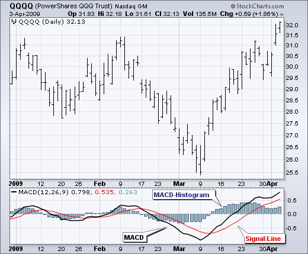
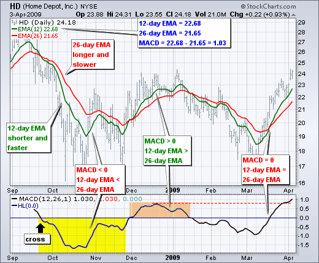

# MACD（Moving Average Convergence/Divergence Oscillator）
[MACD (Moving Average Convergence/Divergence Oscillator)](http://stockcharts.com/school/doku.php?id=chart_school:technical_indicators:moving_average_convergence_divergence_macd)

## Introduction
* Developed by Gerald Appel in the late seventies, the Moving Average Convergence/Divergence oscillator (MACD) is one of the simplest and most effective momentum indicators available. The MACD turns two trend-following indicators, moving averages, into a momentum oscillator by subtracting the longer moving average from the shorter moving average. As a result, the MACD offers the best of both worlds: trend following and momentum. The MACD fluctuates above and below the zero line as the moving averages converge, cross and diverge. Traders can look for signal line crossovers, centerline crossovers and divergences to generate signals. Because the MACD is unbounded, it is not particularly useful for identifying overbought and oversold levels.

* 移动平均辐合发散振荡器(MACD)是由Gerald极大值于70年代后期发展起来的一种最简单、最有效的动量指标。MACD将两个趋势跟踪指标，移动平均线，通过从较短移动平均线中减去较长的移动平均值，变成一个动量振子。因此，MACD提供了最好的两个世界：趋势跟踪和势头。当移动平均线收敛、交叉和发散时，MACD在零线上下波动。交易者可以寻找信号线交叉，中心线交叉和分歧产生信号。因为MACD是无界的，所以它对于识别超买和超卖水平并不特别有用。

* Note: MACD can be pronounced as either “Mac-Dee” or “M-A-C-D.”

#### Here is an example chart with the MACD indicator in the lower panel:

## Calculation
* The MACD Line is the 12-day Exponential Moving Average (EMA) less the 26-day EMA. Closing prices are used for these moving averages. A 9-day EMA of the MACD Line is plotted with the indicator to act as a signal line and identify turns. The MACD Histogram represents the difference between MACD and its 9-day EMA, the Signal line. The histogram is positive when the MACD Line is above its Signal line and negative when the MACD Line is below its Signal line.

* MACD线是12天指数移动平均线(EMA)减去26天均线(EMA).。收盘价用于这些移动平均线。MACD线的9天EMA被绘制成指示符，作为信号线和识别转弯。MACD直方图表示MACD与其9天EMA(信号线)之间的差异.。当MACD线在信号线上方时，直方图为正；当MACD线低于其信号线时，直方图为负值。

> MACD Line: (12-day EMA - 26-day EMA) Signal Line: 9-day EMA of MACD Line MACD Histogram: MACD Line - Signal Line 

* The values of 12, 26 and 9 are the typical setting used with the MACD, however other values can be substituted depending on your trading style and goals.

## Interpretation
* As its name implies, the MACD is all about the convergence and divergence of the two moving averages. Convergence occurs when the moving averages move towards each other. Divergence occurs when the moving averages move away from each other. The shorter moving average (12-day) is faster and responsible for most MACD movements. The longer moving average (26-day) is slower and less reactive to price changes in the underlying security.

* 顾名思义，MACD完全是关于两个移动平均线的收敛和发散。当移动平均线向对方移动时，就会发生收敛。散度是当移动平均线彼此移动时发生的。较短的移动平均时间(12天)更快，并对大多数MACD运动负责.。较长的移动均线(26天)较慢，对基础证券价格变化的反应较小。

* The MACD Line oscillates above and below the zero line, which is also known as the centerline. These crossovers signal that the 12-day EMA has crossed the 26-day EMA. The direction, of course, depends on the direction of the moving average cross. Positive MACD indicates that the 12-day EMA is above the 26-day EMA. Positive values increase as the shorter EMA diverges further from the longer EMA. This means upside momentum is increasing. Negative MACD values indicate that the 12-day EMA is below the 26-day EMA. Negative values increase as the shorter EMA diverges further below the longer EMA. This means downside momentum is increasing.

* MACD线在零线之上和下面振荡，这也被称为中心线。这些交叉信号表明12天的均线已经越过了26天的均线.。当然，方向取决于移动平均交叉的方向。MACD阳性表明，12天的EMA高于26天的EMA.。正值随着EMA时间的缩短而增加，与较长的EMA值进一步偏离。这意味着上行势头正在增强。负MACD值表明12天均线低于26天均线.。随着EMA时间越短，EMA值越低，负值越大。这意味着下行势头正在增强。

* In the example above, the yellow area shows the MACD Line in negative territory as the 12-day EMA trades below the 26-day EMA. The initial cross occurred at the end of September (black arrow) and the MACD moved further into negative territory as the 12-day EMA diverged further from the 26-day EMA. The orange area highlights a period of positive MACD values, which is when the 12-day EMA was above the 26-day EMA. Notice that the MACD Line remained below 1 during this period (red dotted line). This means the distance between the 12-day EMA and 26-day EMA was less than 1 point, which is not a big difference.

* 在上面的例子中，黄色区域示出了在负的区域中的MACD线，这是因为在26天的EMA之下的12天的EMA交易。最初的交叉发生在9月底（黑箭头），随着12天的EMA进一步偏离26天的EMA，MACD进一步进入负区。橙色区突出显示阳性MACD值的周期，即当12天EMA高于26天EMA时。请注意，在这段期间（红色虚线），MACD线保持在1以下。这意味着12天EMA和26天EMA之间的距离小于1分，这不是很大的差异。

## Signal Line Crossovers
