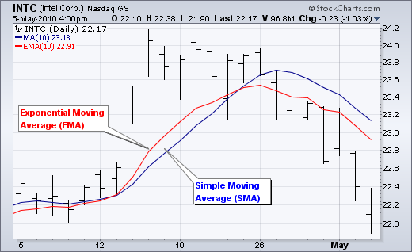
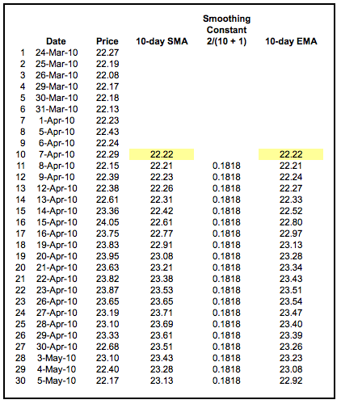
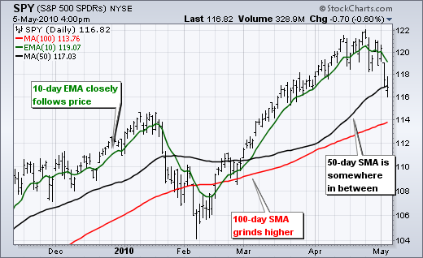
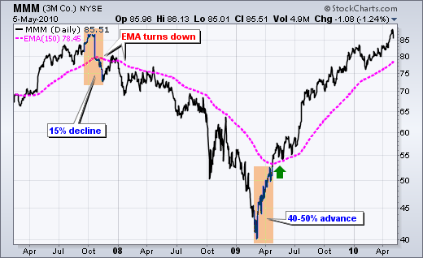

## Moving Averages - Simple and Exponential
[Moving Averages - Simple and Exponential](http://stockcharts.com/school/doku.php?id=chart_school:technical_indicators:moving_averages#simple_vs_exponential_moving_averages)

## Introduction
* Moving averages smooth the price data to form a trend following indicator. They do not predict price direction, but rather define the current direction with a lag. Moving averages lag because they are based on past prices. Despite this lag, moving averages help smooth price action and filter out the noise. They also form the building blocks for many other technical indicators and overlays, such as Bollinger Bands, MACD and the McClellan Oscillator. The two most popular types of moving averages are the Simple Moving Average (SMA) and the Exponential Moving Average (EMA). These moving averages can be used to identify the direction of the trend or define potential support and resistance levels.

* 移动平均线可以平滑价格数据，形成趋势跟踪指标。他们并不预测价格方向，而是用滞后的方式来定义当前的方向。移动平均线之所以滞后，因为它们是基于过去的价格。尽管有这种滞后，移动平均线仍然有助于平稳价格移动和滤除噪音。它们也的构成了许多其他技术指标和覆盖的基石，如Bollinger波段、MACD和McClellan振荡器。最流行的两种移动平均法是简单移动平均法(SMA)和指数移动平均法(EMA)。这些移动平均线可以用来确定趋势的方向或确定潜在的支撑和阻力水平。

#### Here's a chart with both an SMA and an EMA on it:

## Simple Moving Average Calculation
* A simple moving average is formed by computing the average price of a security over a specific number of periods. Most moving averages are based on closing prices. A 5-day simple moving average is the five-day sum of closing prices divided by five. As its name implies, a moving average is an average that moves. Old data is dropped as new data comes available. This causes the average to move along the time scale. Below is an example of a 5-day moving average evolving over three days.

* 简单移动平均(SMA)是通过计算证券在特定时期内的平均价格而形成的。大多数移动均线都是基于收盘价。5天简单移动平均线是5天收盘价总和除以5。顾名思义，移动平均线就是移动的平均线。当新数据可用时，将删除旧数据。这导致平均沿时间尺度移动。下面是一个五天移动平均演变在三天内的例子。

> Daily Closing Prices: 11,12,13,14,15,16,17 First day of 5-day SMA: (11 + 12 + 13 + 14 + 15) / 5 = 13 Second day of 5-day SMA: (12 + 13 + 14 + 15 + 16) / 5 = 14 Third day of 5-day SMA: (13 + 14 + 15 + 16 + 17) / 5 = 15 

* The first day of the moving average simply covers the last five days. The second day of the moving average drops the first data point (11) and adds the new data point (16). The third day of the moving average continues by dropping the first data point (12) and adding the new data point (17). In the example above, prices gradually increase from 11 to 17 over a total of seven days. Notice that the moving average also rises from 13 to 15 over a three-day calculation period. Also, notice that each moving average value is just below the last price. For example, the moving average for day one equals 13 and the last price is 15. Prices the prior four days were lower and this causes the moving average to lag.

## Exponential Moving Average Calculation
* Exponential moving averages (EMAs) reduce the lag by applying more weight to recent prices. The weighting applied to the most recent price depends on the number of periods in the moving average. EMAs differ from simple moving averages in that a given day's EMA calculation depends on the EMA calculations for all the days prior to that day. You need far more than 10 days of data to calculate a reasonably accurate 10-day EMA.

* 指数移动平均线(EMAs)是通过对最近的价格施加更多的权重来减少延迟。对最近价格的加权数取决于移动平均数中的周期数。EMA不同于简单的移动平均值，因为给定一天的EMA计算取决于该天之前的所有天的EMA计算。你需要远超过10天的数据来计算一个合理准确的10天均线。

* There are three steps to calculating an exponential moving average (EMA). First, calculate the simple moving average for the initial EMA value. An exponential moving average (EMA) has to start somewhere, so a simple moving average is used as the previous period's EMA in the first calculation. Second, calculate the weighting multiplier. Third, calculate the exponential moving average for each day between the initial EMA value and today, using the price, the multiplier, and the previous period's EMA value. The formula below is for a 10-day EMA.

* 计算指数移动平均(EMA)有三个步骤。首先，计算初始EMA值的简单移动平均。指数移动平均(EMA)必须从某个地方开始，因此在第一次计算中使用一个简单的移动平均作为前一周期的EMA。第二，计算加权乘数。第三，利用价格、乘数和前一时期的均线值，计算初始均线值到今天的指数移动平均。下面的公式是10天的均线。

> Initial SMA: 10-period sum / 10 Multiplier: (2 / (Time periods + 1) ) = (2 / (10 + 1) ) = 0.1818 (18.18%) EMA: {Close - EMA(previous day)} x multiplier + EMA(previous day) 

## The Weighting Multiplier
* A 10-period exponential moving average applies an 18.18% weighting to the most recent price. A 10-period EMA can also be called an 18.18% EMA. A 20-period EMA applies a 9.52% weighting to the most recent price (2/(20+1) = .0952). Notice that the weighting for the shorter time period is more than the weighting for the longer time period. In fact, the weighting drops by half every time the moving average period doubles.

* 10周期指数移动平均指数对最近的价格适用18.18%的权重。一个10周期的均线也可以称为18.18%均线。20期均线对最近的价格(2/(201)=.0952)适用9.52%的权重。注意，较短时间段的加权要大于较长时间段的加权。事实上，每次移动平均周期加倍时，权重就会下降一半。

* If you want to use a specific percentage for an EMA, you can use this formula to convert it to time periods and then enter that value as the EMA's parameter:

* 如果要对EMA使用特定百分比，可以使用此公式将其转换为时间段，然后输入该值作为EMA的参数：

> Time Period = (2 / Percentage) - 1 3% Example:  Time Period = (2 / 0.03) - 1 = 65.67 time periods 

## EMA Accuracy（精度）
* Below is a spreadsheet example of a 10-day simple moving average and a 10-day exponential moving average for Intel. The SMA calculation is straightforward and requires little explanation: the 10-day SMA simply moves as new prices become available and old prices drop off. The exponential moving average in the spreadsheet starts with the SMA value (22.22) for its first EMA value. After the first calculation, the normal EMA formula is used.

* 下面是一个电子表格的例子，10天简单移动平均和10天指数移动平均英特尔。SMA的计算很简单，几乎不需要解释：10天的SMA只是随着新价格的出现和旧价格的下跌而移动。电子表格中的指数移动平均值以其第一个均线值的sma值(22.22)开始。在第一次计算后，采用了常规的EMA公式。

* The formula for an EMA incorporates the previous period's EMA value, which in turn incorporates the value for the EMA value before that, and so on. Each previous EMA value accounts for a small portion of the current value. Therefore, the current EMA value will change depending on how much past data you use in your EMA calculation. Ideally, for a 100% accurate EMA, you should use every data point the stock has ever had in calculating the EMA, starting your calculations from the first day the stock existed. This is not always practical, but the more data points you use, the more accurate your EMA will be. The goal is to maximize accuracy while minimizing calculation time.

* EMA的公式包含了上一时期的EMA值，而EMA值又包含了之前的EMA值，依此类推。以前的每个EMA值占当前值的一小部分。因此，当前的EMA值将根据您在EMA计算中使用的过去数据的多少而改变。理想情况下，对于100%准确的均线，你应该使用股票在计算均线时所拥有的每一个数据点，从股票存在的第一天开始计算。这并不总是实用的，但是使用的数据点越多，EMA就越准确。目标是最大限度地提高精度，同时最小化计算时间。

* The spreadsheet example below goes back 30 periods. With only 30 data points incorporated in the EMA calculations, the 10-day EMA values in the spreadsheet are not very accurate. On our charts, we calculate back at least 250 periods (typically much further), resulting in EMA values that are accurate to within a fraction of a penny.

* 下面的电子表格示例可以追溯到前30个句点。EMA计算中只有30个数据点，电子表格中10天的EMA值并不十分准确。在我们的图表上，我们计算了至少250个周期(通常更远)，结果是EMA值精确到一个便士的一小部分。

## The Lag Factor

* The longer the moving average, the more the lag. A 10-day exponential moving average will hug prices quite closely and turn shortly after prices turn. Short moving averages are like speedboats - nimble and quick to change. In contrast, a 100-day moving average contains lots of past data that slows it down. Longer moving averages are like ocean tankers - lethargic and slow to change. It takes a larger and longer price movement for a 100-day moving average to change course.

* 移动平均线越长，滞后就越大。10天指数移动平均线会紧紧地拥抱价格，在价格转跌后不久就会回升。短距离移动平均线就像快艇一样--敏捷且变化迅速。相比之下，100天移动平均线包含了许多过去的数据，这些数据使其速度减慢。较长的移动平均线就像海洋油轮——沉闷而缓慢的变化。一个100天的移动平均线需要更大和更长的价格变动才能改变方向。

* The chart above shows the S&P 500 ETF with a 10-day EMA closely following prices and a 100-day SMA grinding higher. Even with the January-February decline, the 100-day SMA held the course and did not turn down. The 50-day SMA fits somewhere between the 10- and 100-day moving averages when it comes to the lag factor.

* 上图显示，标普500ETF的10天均线紧跟随价格，100天形状记忆合金磨削更高。即使在一月到二月的下跌，100天的SMA坚持了这个过程，并没有拒绝.。当谈到滞后因素时，50天的SMA介于10天和100天的移动均线之间。

## Simple vs Exponential Moving Averages
* Even though there are clear differences between simple moving averages and exponential moving averages, one is not necessarily better than the other. Exponential moving averages have less lag and are therefore more sensitive to recent prices - and recent price changes. Exponential moving averages will turn before simple moving averages. Simple moving averages, on the other hand, represent a true average of prices for the entire time period. As such, simple moving averages may be better suited to identify support or resistance levels.

* 尽管简单移动平均线和指数移动平均有明显的区别，但其中一个并不一定比另一个好。指数移动平均线的滞后较小，因此对近期价格和近期价格变化更为敏感。指数移动平均将在简单移动平均线之前发生变化。另一方面，简单的移动平均线代表整个时期的真实平均价格。因此，简单的移动平均线可能更适合于识别支撑或阻力水平。

* Moving average preference depends on objectives, analytical style, and time horizon. Chartists should experiment with both types of moving averages as well as different timeframes to find the best fit. The chart below shows IBM with the 50-day SMA in red and the 50-day EMA in green. Both peaked in late January, but the decline in the EMA was sharper than the decline in the SMA. The EMA turned up in mid-February, but the SMA continued lower until the end of March. Notice that the SMA turned up over a month after the EMA.

* 移动平均偏好取决于目标、分析风格和时间范围。艺术家应该试验两种类型的移动平均线以及不同的时间框架，以找到最佳匹配。下图显示IBM的50天形状记忆合金为红色，50天EMA为绿色.。这两种货币在1月底都达到了顶峰，但EMA的下降比SMA的下降更为剧烈。EMA在2月中旬出现，但SMA一直到3月底才开始走低.。注意，SMA出现在EMA后一个多月。

## Lengths and Timeframes
* The length of the moving average depends on the analytical objectives. Short moving averages (5-20 periods) are best suited for short-term trends and trading. Chartists interested in medium-term trends would opt for longer moving averages that might extend 20-60 periods. Long-term investors will prefer moving averages with 100 or more periods.

* 移动平均的长度取决于分析目标。短期移动平均线(5-20期)最适合短期趋势和交易.。对中期趋势感兴趣的ChArters会选择更长的移动平均线，这可能会延长20-60个时期。长期投资者会更喜欢有100个或更多周期的移动平均线.

* Some moving average lengths are more popular than others. The 200-day moving average is perhaps the most popular. Because of its length, this is clearly a long-term moving average. Next, the 50-day moving average is quite popular for the medium-term trend. Many chartists use the 50-day and 200-day moving averages together. Short-term, a 10-day moving average was quite popular in the past because it was easy to calculate. One simply added the numbers and moved the decimal point.

* 一些移动平均长度比其他移动平均长度更受欢迎。200天移动平均线可能是最受欢迎的。由于它的长度，这显然是一个长期移动平均.。接下来，50天移动平均线在中期趋势中很受欢迎.。许多人物使用50天和200天的移动平均线。短期而言，10天移动平均线在过去相当流行，因为它很容易计算。其中一个简单地添加了数字并移动了小数点。

## Trend Identification
* The same signals can be generated using simple or exponential moving averages. As noted above, the preference depends on each individual. These examples below will use both simple and exponential moving averages. The term “moving average” applies to both simple and exponential moving averages.

* 同样的信号可以用简单的或指数的移动平均值产生。如上所述，偏好取决于每个人。下面的这些例子将使用简单的和指数的移动平均值。“移动平均”一词既适用于简单移动平均，也适用于指数移动平均。

* The direction of the moving average conveys important information about prices. A rising moving average shows that prices are generally increasing. A falling moving average indicates that prices, on average, are falling. A rising long-term moving average reflects a long-term uptrend. A falling long-term moving average reflects a long-term downtrend.

* 移动平均线的方向传达了有关价格的重要信息。上升的移动平均线显示价格普遍在上涨。下跌的移动平均线表明，平均价格正在下降。长期移动均线上升反映了长期上升趋势.。长期移动均线下跌反映了长期下跌趋势。

* The chart above shows 3M (MMM) with a 150-day exponential moving average. This example shows just how well moving averages work when the trend is strong. The 150-day EMA turned down in November 2007 and again in January 2008. Notice that it took a 15% decline to reverse the direction of this moving average. These lagging indicators identify trend reversals as they occur (at best) or after they occur (at worst). MMM continued lower into March 2009 and then surged 40-50%. Notice that the 150-day EMA did not turn up until after this surge. Once it did, however, MMM continued higher the next 12 months. Moving averages work brilliantly in strong trends.

* 上图显示了3M(MMM)公司的150天指数移动平均.。这个例子显示了当趋势很强时移动平均线是如何工作的。为期150天的均线考试在2007年11月和2008年1月又一次被拒绝.。请注意，这一移动平均线的方向发生了15%的下跌。这些滞后指标在发生(最多)或发生后(最坏的情况)时确定趋势逆转。MMM持续下跌至2009年3月，随后上涨40至50%。请注意，150天的均线没有出现，直到这次激增。然而，一旦做到了，MMM在接下来的12个月里继续走高。移动平均线在强劲趋势中发挥了出色的作用。

## Double Crossovers
* Two moving averages can be used together to generate crossover signals. In Technical Analysis of the Financial Markets, John Murphy calls this the “double crossover method”. Double crossovers involve one relatively short moving average and one relatively long moving average. As with all moving averages, the general length of the moving average defines the timeframe for the system. A system using a 5-day EMA and 35-day EMA would be deemed short-term. A system using a 50-day SMA and 200-day SMA would be deemed medium-term, perhaps even long-term.

* 两个移动平均线可以一起用来产生交叉信号。在“金融市场的技术分析”中，约翰·墨菲称这是“双交叉方法”。双交叉包括一个相对较短的移动平均线和一个相对长的移动平均线。与所有移动平均值一样，移动平均值的一般长度定义了系统的时间框架。使用5天均线和35天均线的系统将被认为是短期的.。使用50天SMA和200天SMA的系统将被视为中期，甚至可能是长期的。

* A bullish crossover occurs when the shorter moving average crosses above the longer moving average. This is also known as a golden cross. A bearish crossover occurs when the shorter moving average crosses below the longer moving average. This is known as a dead cross.

* 当较短的移动平均线超过较长的移动平均线时，就会出现看涨的交叉。这也被称为黄金十字架（金叉）。当较短的移动平均线低于较长的移动平均线时，就会出现看跌交叉。这就是所谓的死十字架（死叉）。

* Moving average crossovers produce relatively late signals. After all, the system employs two lagging indicators. The longer the moving average periods, the greater the lag in the signals. These signals work great when a good trend takes hold. However, a moving average crossover system will produce lots of whipsaws in the absence of a strong trend.

* 移动平均交叉产生相对较晚的信号。毕竟，该系统采用了两个滞后指标。移动平均周期越长，信号的滞后就越大。当好的趋势形成时，这些信号就会发挥巨大的作用。然而，在没有强劲趋势的情况下，移动平均交叉系统将产生大量的鞭子。

* There is also a triple crossover method that involves three moving averages. Again, a signal is generated when the shortest moving average crosses the two longer moving averages. A simple triple crossover system might involve 5-day, 10-day, and 20-day moving averages.

* 还有一个三重交叉方法，涉及三个移动平均值。同样，当最短移动平均线与两个较长的移动平均线相交时，会产生信号。一个简单的三重交叉系统可能涉及5天、10天和20天移动平均线。

