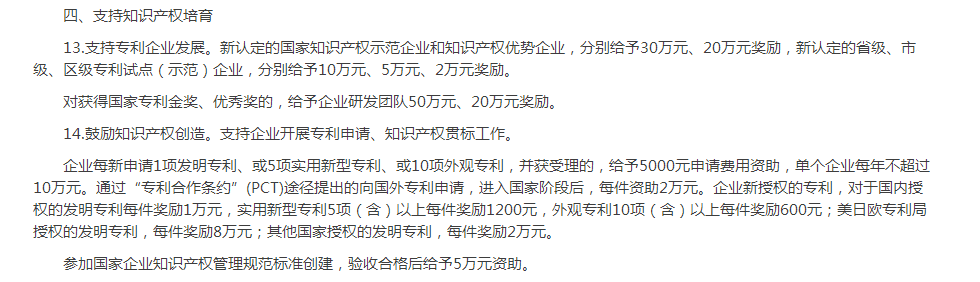
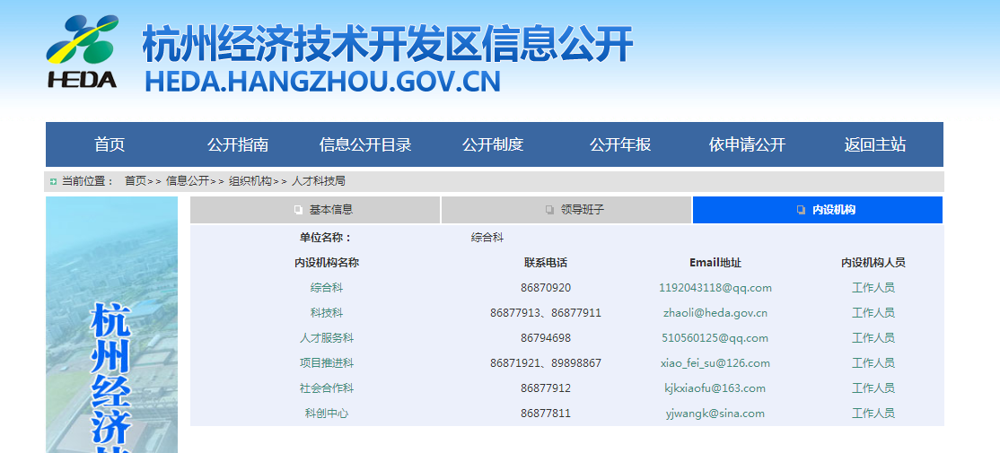

## 杭州经济开发区专利奖励政策

> 专利的事找人才科技局科技科，赵利（女），电话：0571-86877911

> 每年3年月份通知会下来，申请前一年的专利奖励和补助。 
> 知识产权是【创新创业政策资金】其中一条政策。 
> [这是2018年通知，去申请2017年的资金。 知识产权属于申报政策第14条。](http://heda.hangzhou.gov.cn/art/2018/3/14/art_1385951_16064436.html) 
> 《杭州经济技术开发区关于推进科技创新创业的若干政策2018》[（word文件下载）]（杭州经济技术开发区关于推进科技创新创业的若干政策2018.docx）
